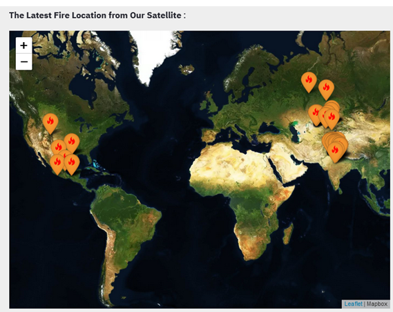
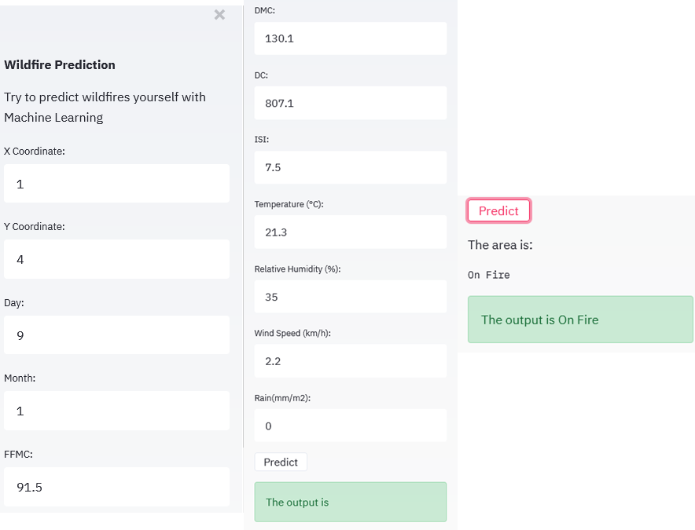

# Streamlit-Wildfire-Prediction

We are using the Forest Fires Dataset from the [ UCI Machine Learning Repository Forest Fires Data Set](https://archive.ics.uci.edu/dataset/162/forest+fires). The original dataset provides multiple features to predict whether a fire will occur in a given area. We applied preprocessing techniques to clean the dataset so that we can treat it as a classification problem.

We compare serveral different ML alogthrims,More information about the Machine Learning model can be found at [Forest-Fire-Area-Classification](https://github.com/e96031413/Forest-Fire-Area-Classification)

# Visual Overview of Web Content

Here, we use Streamlit for web deployment and have deployed the model on the website for users to utilize.

Reference : 
  [streamlit-folium](https://discuss.streamlit.io/t/ann-streamlit-folium-a-component-for-rendering-folium-maps/4367)、
  [streamlit-deploy a machine-learning-model-1](https://www.geeksforgeeks.org/deploy-a-machine-learning-model-using-streamlit-library/)、
  [streamlit-deploy a machine-learning-model-2](https://dev.to/shivam_bhirud/streamlit-deploy-a-machine-learning-model-without-learning-any-web-framework-40dn)
